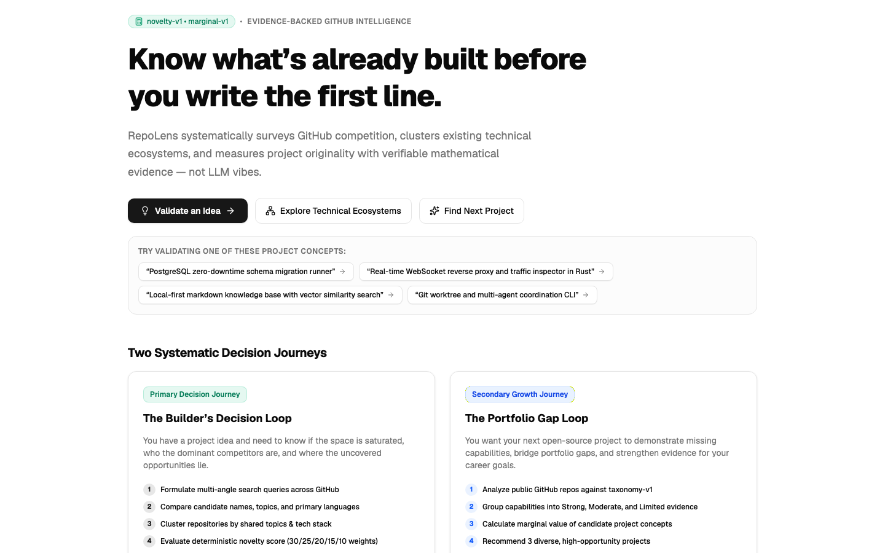
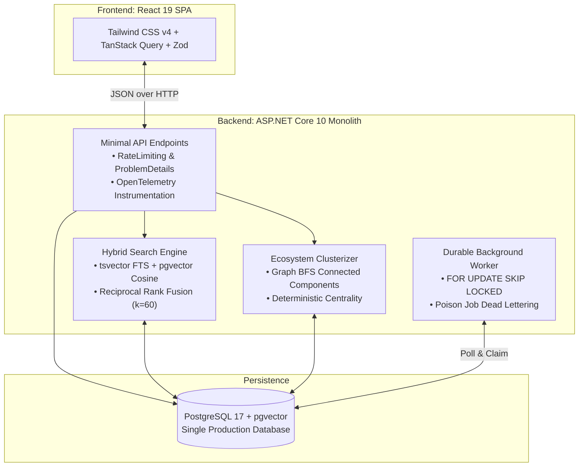

# RepoLens: Evidence-Backed GitHub Ecosystem Intelligence

[](https://dotnet.microsoft.com/)
[](https://react.dev/)
[](https://github.com/pgvector/pgvector)
[](#architecture)
[](#scoring-and-evidence-methodology)
[](#automated-testing-and-verification)

**RepoLens** is an evidence-backed GitHub ecosystem analysis platform that helps software engineers and technical founders decide **what to build next**.

It runs bounded GitHub searches, builds candidate similarity graphs, and computes deterministic, explainable scores for idea saturation, competitor proximity, and portfolio value. PostgreSQL full-text search and pgvector cosine similarity provide hybrid retrieval through Reciprocal Rank Fusion, while LLMs are limited to query expansion and candidate-idea generation.

<p align="center">
  
</p>

---

## Why RepoLens?

Every week, developers and engineering teams start open-source projects or developer tools without understanding the competitive landscape:
- **The GitHub Star Fallacy:** Stars reflect historical virality, not ongoing maintenance or current architecture. A project with 15k stars may be unmaintained for 3 years, leaving an open niche for a modern alternative.
- **LLM Hallucination & Sycophancy:** General-purpose AI output can praise a project idea without first verifying existing implementations or inspecting relevant repositories.
- **Unbounded Claims:** Existing search tools make sweeping generalizations ("nothing like this exists") without identifying the exact evaluated candidate set.

RepoLens enforces **"Conclusion → Why → Evidence → Methodology"**:
1. **Bounded candidate sets:** Every metric is scoped strictly to the evaluated candidate set gathered via multi-angle search plans ($N$ repositories).
2. **Deterministic math:** Scores are computed exclusively by versioned mathematical equations (`novelty-v1`, `rec-v1`, `marginal-v1`). LLMs never compute scores.
3. **Strict LLM boundaries:** LLMs are restricted to brainstorming candidate titles and search queries. If an LLM is offline or unconfigured, RepoLens executes seamlessly using deterministic offline fallbacks.

---

## Two Core Pillars

```
┌──────────────────────────────────────────────────────────────────────────┐
│                                REPOLENS                                  │
├─────────────────────────────────────┬────────────────────────────────────┤
│       DECIDE WHAT TO BUILD          │        EXPLORE & RESEARCH          │
│   • Validate an Idea (/validate)    │   • Ecosystem Analysis (/ecosystem)│
│   • Find Next Project (/recommend)  │   • Hybrid Search (/search)        │
│   • Portfolio Gaps (/portfolio)     │   • Explore Live GitHub (/discover)│
└─────────────────────────────────────┴────────────────────────────────────┘
```

### Pillar 1: Decide What to Build
- **Validate an Idea (`/validate`):** Formulates a multi-query search plan, gathers candidates, clusters the similarity graph, calculates a deterministic `novelty-v1` score (0–100), and flags the closest 3 competitors with specific overlap reasons.
- **Decide What to Build Next (`/recommend`):** Generates 3 diverse project proposals ranked by the `rec-v1` multi-factor formula, balancing originality, portfolio marginal value, feasibility, and goal fit.
- **Portfolio Gap Analysis (`/portfolio`):** Maps a GitHub profile against an 11-category software engineering taxonomy, identifying areas of strong, moderate, or limited evidence. Provides a **"Bridge Gap"** action bridge directly into the recommendation engine.

### Pillar 2: Explore & Research
- **Ecosystem Intelligence (`/ecosystem`):** Maps connected-component project clusters, market concentration, language distributions, and maintenance velocity for any software domain.
- **Hybrid Search Engine (`/search`):** Combines PostgreSQL full-text search (`tsvector`) and dense vector similarity (`pgvector`) fused via **Reciprocal Rank Fusion ($k=60$)**.
- **Repository Deep Dive (`/repositories/:id`):** Enriched metadata, normalized README content, topics, language shares, and similar project recommendations.

---

## Architecture

RepoLens is built as a **modular monolith** with zero speculative abstractions (no CQRS boilerplate, no generic repository layers, no external message brokers).



### Key Engineering Principles
- **Single Production Database:** PostgreSQL with `pgvector` handles relational tables, JSON payloads, full-text indexes, and 1536-dimensional embeddings. No separate vector database or synchronization pipeline.
- **Durable In-Database Queue:** Asynchronous enrichment jobs are processed using PostgreSQL `FOR UPDATE SKIP LOCKED`, supporting crash recovery, exponential backoff, and GitHub rate-limit reset scheduling.
- **Deterministic Clustering:** Breadth-first search (BFS) over topic and token Dice coefficients generates connected components with deterministic ID sorting (ADR 002).

---

## Scoring and Evidence Methodology

All formulas are versioned in code and documented in [`docs/scoring.md`](docs/scoring.md).

### 1. Estimated Novelty (`novelty-v1`)

Computed over the evaluated candidate set ($N$ repositories):

$$\text{Novelty} = \text{round}\left(100 \times \left(0.30 \cdot C_{\text{gap}} + 0.25 \cdot D_{\text{sim}} + 0.20 \cdot S_{\text{cluster}} + 0.15 \cdot A_{\text{act}} + 0.10 \cdot R_{\text{dup}}\right)\right)$$

| Weight | Component | Meaning & Formula |
|---|---|---|
| **30%** | **Closest Competitor Distance** | $1 - \max \text{Overlap}(\text{idea}, \text{competitors})$ |
| **25%** | **Similarity Density** | $1 - \text{MeanPairwiseSimilarity}(\text{candidates})$ |
| **20%** | **Largest Cluster Share** | $1 - \frac{|\text{Largest Cluster}|}{N}$ |
| **15%** | **Active Competitor Scarcity** | $\text{clamp}\left(1 - \frac{\text{Active}_{\text{90d}}}{20}, 0, 1\right)$ |
| **10%** | **Near-Duplicate Scarcity** | $1 - \frac{\text{Pairs}(\text{score} \ge 0.70)}{\binom{N}{2}}$ |

### 2. Recommendation Ranking (`rec-v1`)

Ranks brainstormed project candidates deterministically:

$$\text{Score} = 0.30 \cdot \text{Originality} + 0.20 \cdot \text{PortfolioMarginal} + 0.20 \cdot \text{Feasibility} + 0.15 \cdot \text{GoalAlignment} + 0.15 \cdot \text{InterestAlignment}$$

- **Originality (30%):** Estimated novelty score $/ 100$.
- **Portfolio Marginal Value (20%):** Value added to developer's public GitHub portfolio based on taxonomy coverage ($0.5$ neutral without username).
- **Feasibility (20%):** Text-derived scope estimate (integration and infrastructure signals) weighted against target timeframe.
- **Goal & Interest Alignment (15% + 15%):** Category keyword overlap against developer goals.

---

## Quickstart

### Prerequisites
- [.NET SDK 10](https://dotnet.microsoft.com/download) (`global.json`)
- [Node.js 24+](https://nodejs.org/) & npm
- [Docker](https://www.docker.com/) (for PostgreSQL 17 + pgvector)

### Local Development

1. **Start the database:**
   ```bash
   docker compose up -d postgres
   ```
2. **Start the ASP.NET Core API:**
   ```bash
   dotnet run --project src/RepoLens.Api
   # API listening on http://localhost:5190 (Health check: http://localhost:5190/health)
   ```
3. **Start the React frontend:**
   ```bash
   cd src/RepoLens.Web
   npm ci
   npm run dev
   # Vite dev server listening on http://localhost:5173
   ```

### Full Stack via Docker Compose
To run the full multi-container deployment stack (PostgreSQL + API + Nginx SPA) in containers:
```bash
docker compose --profile full up --build
# Web application available at http://localhost:8080
```

---

## Automated Testing and Verification

RepoLens is covered by pure unit tests and containerized PostgreSQL integration tests:

```bash
# 1. Build the solution
dotnet build RepoLens.sln

# 2. Run unit tests (Pure algorithmic logic, scorers, clustering, RRF)
dotnet test tests/RepoLens.UnitTests
# Passed: 93/93

# 3. Run integration tests (Testcontainers PostgreSQL + WireMock.Net)
dotnet test tests/RepoLens.IntegrationTests
# Passed: 73/73 (Requires Docker daemon; total 166/166 passing)

# 4. Verify frontend contracts, types, and styles
cd src/RepoLens.Web
npm run typecheck   # TypeScript check (0 errors)
npm run lint        # Oxlint linter (0 warnings)
npm run build       # Production bundle build
```

---

## Documentation Index

- [**Technical Case Study**](docs/case-study.md) — Comprehensive deep-dive on architectural decisions, trade-offs, resilience, and quantifiable impact.
- [**Reference Benchmark Fixtures**](docs/benchmarks.md) — Six deterministic scenarios for regression, edge-case validation, and algorithm behavior.
- [**Scoring Formulas**](docs/scoring.md) — Mathematical definitions of `novelty-v1`, `marginal-v1`, `rec-v1`, and `taxonomy-v1`.
- [**Search & Ranking**](docs/search-ranking.md) — FTS weights, dense vector cosine similarity, and RRF $k=60$ details.
- [**Analysis Limitations**](docs/analysis-limitations.md) — Candidate set boundary declarations and non-claims.
- [**Architecture Decision Records (ADRs)**](docs/decisions/) — ADR 001 (Monolith), ADR 002 (In-process clustering vs Python/HDBSCAN), ADR 003 (LLM boundaries).
- [**API Surface**](docs/api-surface.md) — Complete endpoint inventory with HTTP methods, rate limits, and schemas.
