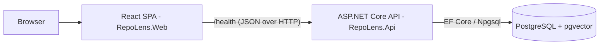

# Architecture

## Current shape (walking skeleton)

A modular monolith: one ASP.NET Core API and one React SPA, sharing a single
PostgreSQL database.

### Components

| Path | Responsibility |
| --- | --- |
| `src/RepoLens.Api` | Composition root: hosting, configuration, logging, OpenTelemetry, health checks. Currently the only endpoint is `GET /health`, which returns `200 Healthy` only when the API can reach PostgreSQL. |
| `src/RepoLens.Infrastructure` | Persistence: EF Core `RepoLensDbContext` wired to PostgreSQL via Npgsql. Domain tables will be added here as features land. |
| `src/RepoLens.Application` | Intentionally empty. Future home of feature modules (`Discovery`, `Analysis`, `Recommendation`, `Portfolio`) — feature-oriented, no business logic yet. |
| `src/RepoLens.Domain` | Intentionally empty. Future home of domain entities. |
| `src/RepoLens.Web` | React + TypeScript + Vite SPA. Shows the API/database status by polling `/health` through TanStack Query. |

### Cross-cutting choices

- **Logging**: structured (JSON) console output outside Development; human-readable console in Development. OpenTelemetry captures the same events for export.
- **OpenTelemetry**: ASP.NET Core and HttpClient instrumentation are registered. Nothing is exported until `OTEL_EXPORTER_OTLP_ENDPOINT` is set — no collector is required locally.
- **Configuration**: `appsettings.json` + `appsettings.{Environment}.json`, overridable via environment variables (`ConnectionStrings__DefaultConnection`). Development credentials are development-only values, never real secrets.

## Test layout

- `tests/RepoLens.UnitTests` — pure-logic unit tests (none yet; no domain logic exists).
- `tests/RepoLens.IntegrationTests` — Testcontainers-backed tests against a real
  `pgvector/pgvector` PostgreSQL container; the API is hosted via
  `WebApplicationFactory`; WireMock.Net is available for external HTTP mocks.

## Future direction (not implemented)

When features land, the monolith will grow, not split:

- **Background workers** for crawling/indexing GitHub data,
- a **GitHub adapter** (external API access at the edge),
- an **analysis pipeline** for clustering/novelty/portfolio analysis using
  pgvector similarity in PostgreSQL.

If a genuinely independent subsystem with different scaling needs emerges later,
it can be extracted from the monolith — that decision belongs in an ADR.
