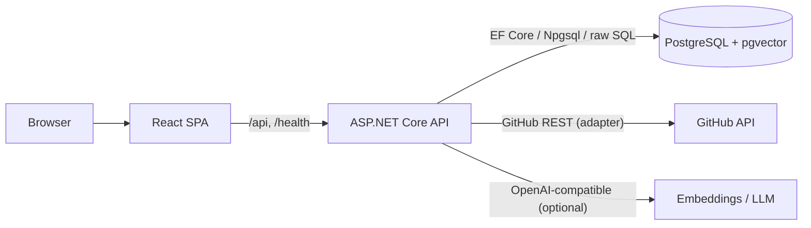

# Architecture

A modular monolith: one ASP.NET Core API and one React SPA sharing a single
PostgreSQL database (+ pgvector).

## Layers

| Path | Responsibility |
| --- | --- |
| `src/RepoLens.Api` | Composition root: hosting, endpoints per feature, typed error mapping (ProblemDetails, raw GitHub text never leaks), rate limiting, session auth, background workers, migrations on startup. |
| `src/RepoLens.Application` | Use cases + pure scoring/similarity/clustering logic, ports (interfaces) for GitHub, stores, embeddings, LLM. Feature folders: Discovery, Enrichment, Searching, Analysis (ecosystem), IdeaValidation, Portfolio, Recommendation, Ai, Identity. No EF, no HTTP. |
| `src/RepoLens.Domain` | Entities with guarded state transitions; EF-agnostic. |
| `src/RepoLens.Infrastructure` | GitHub HTTP adapters (search, enrichment, user listing, OAuth), OpenAI-compatible embedding + LLM clients, Markdig README normalization, EF Core mappings + stores (raw SQL for pgvector/tsvector legs and job claims). |
| `src/RepoLens.Web` | React 19 + TS + Vite SPA (TanStack Query, React Router, Tailwind v4, shadcn/ui, Zod at the network boundary). |

## Product flows

1. **Explore GitHub** — `GET /api/discovery/repositories` searches GitHub,
   normalizes, persists repositories idempotently (identity = GitHub numeric
   id), auto-enqueues enrichment for never-enriched repos.
2. **Repository detail + enrichment** — `GET /api/repositories/{id}` and
   `POST /api/repositories/{id}/refresh`; the durable PostgreSQL-backed worker
   enriches metadata/README/topics/languages, snapshots metrics, retries with
   bounded backoff, and survives restarts.
3. **Hybrid search + similarity** — `GET /api/search/repositories`
   (FTS + vector, RRF) and `GET /api/repositories/{id}/similar`; documents are
   indexed after enrichment, embeddings backfilled on a budget.
4. **Ecosystem analysis** — `POST /api/analysis/ecosystem`: deterministic query
   variants → bounded candidates → similarity-graph clusters → metrics +
   evidence snapshot (replay via `GET /api/analysis/ecosystem/{id}`).
5. **Idea validation** — `POST /api/analysis/idea`: search plan (LLM-optional
   with deterministic fallback), novelty-v1 scoring, competitors, gaps;
   PostgreSQL-backed 24h cache keyed by normalized idea hash.
6. **Portfolio intelligence** — `GET /api/portfolio/{username}` (signals +
   coverage) and `POST /api/portfolio/{username}/marginal`; public metadata
   only.
7. **Recommendations** — `POST /api/recommendations`: LLM/fallback candidates →
   per-candidate GitHub validation → rec-v1 ranking with diversity +
   explainability; request-hash cache.
8. **Account & history** — optional GitHub OAuth with signed HTTP-only session
   cookies (off until configured); signed-in analyses are saved to history.

## Cross-cutting

- **Persistence**: single EF Core `RepoLensDbContext`; migrations applied at
  startup; jsonb snapshots keep analysis reports reproducible; tsvector/vector
  columns are migration-managed (raw SQL).
- **Errors**: typed exceptions → stable ProblemDetails codes
  (`github_rate_limited` 429 with Retry-After, `upstream_error` 502,
  `not_found` 404, …).
- **Jobs**: PostgreSQL job table; `FOR UPDATE SKIP LOCKED` claims; crash
  recovery sweep; partial unique index (one active job per repository).
- **Rate limiting**: ASP.NET Core rate limiter — global 300 req/min per client,
  `expensive` 20 req/min on analyses/refresh/recommendations.
- **Observability**: structured JSON logs (Development: console),
  OpenTelemetry tracing/metrics (export opt-in via
  `OTEL_EXPORTER_OTLP_ENDPOINT`); custom meters for enrichment job outcomes +
  analysis durations.
- **Security**: env-supplied secrets only; same-origin cookies HttpOnly +
  SameSite=Lax (+ Secure outside Development); OAuth minimum scope; no CORS
  surface beyond defaults.

## Test layout

- Unit tests: pure logic — normalization, job transitions, RRF, novelty,
  clustering, scoring, taxonomy, plans.
- Integration tests: real Testcontainers PostgreSQL + WireMock.Net GitHub/LLM —
  adapter behavior, persistence constraints, retrieval, API flows incl. cache
  paths and error mapping. CI always runs them.
