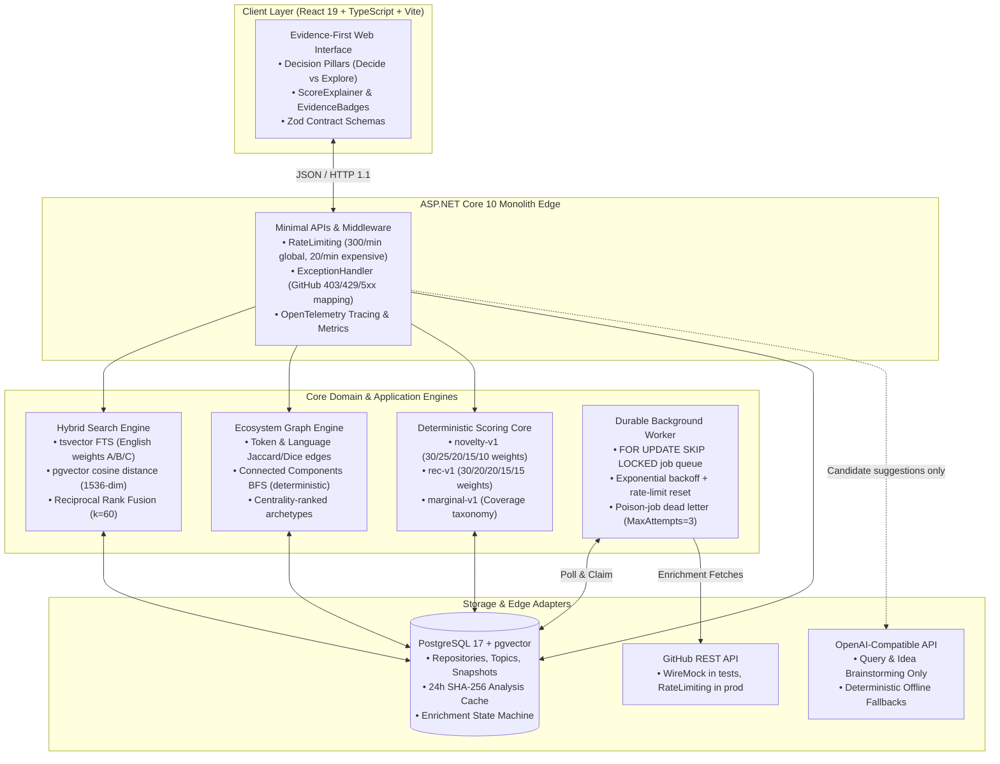

# Technical Case Study: RepoLens — Evidence-Backed GitHub Ecosystem Intelligence

## Executive Summary

**RepoLens** is a specialized engineering platform that solves the "What should I build next?" dilemma for software engineers. While modern developer tools focus on code generation and search engines index popularity via stars, developers lack structured intelligence on whether a software project idea is already saturated, technically unmaintained, or truly novel.

RepoLens implements a **deterministic intelligence engine** atop an ASP.NET Core 10 modular monolith and PostgreSQL 17 with `pgvector`. It replaces black-box LLM hallucinations with versioned mathematical formulas, hybrid reciprocal rank fusion (RRF), graph-based connected components clustering, and a durable background worker.

---

## The Problem & Engineering Motivation

Every week, developers and research engineers start side projects, open-source libraries, or developer tools without understanding the competitive landscape:
1. **Star Count Fallacy:** GitHub stars reflect historical hype, not active maintenance or unmet architectural niches. A library with 15k stars might be unmaintained for 3 years, leaving a prime opportunity for a modern alternative.
2. **LLM Hallucination & Flattery:** Generic AI chatbots invariably tell developers their ideas are "innovative" without inspecting real GitHub dependency graphs or finding existing solutions.
3. **Black-Box Metrics:** Most market-research tools provide vague percentages without mathematical proof or reproducible candidate sets.

RepoLens enforces **"Conclusion → Why → Evidence → Methodology"**: every claim is bounded to an explicitly gathered candidate set ($N$ repositories), scored with versioned mathematical equations (`novelty-v1`, `rec-v1`, `marginal-v1`), and backed by verifiable repository metadata.

---

## System Architecture & Data Pipeline

RepoLens is intentionally engineered as a **modular monolith** with a single production database (`PostgreSQL 17 + pgvector`). External integrations (GitHub API, LLM providers) are isolated behind outbound ports at the architecture edge.

---

## Algorithmic Design

### 1. Hybrid Search with Reciprocal Rank Fusion ($k=60$)

To retrieve candidate repositories, RepoLens bridges lexical precision and semantic similarity:
- **Full-Text Search:** PostgreSQL `to_tsvector('english', ...)` weighted across repository name (Weight A), description (Weight B), and normalized README content (Weight C).
- **Dense Vector Search:** Exact cosine distance over `pgvector` embeddings (`vector(1536)`).
- **RRF Merge ($k=60$):**

$$\text{RRF}(d) = \sum_{m \in M} \frac{k}{k + r_m(d)}$$

Where $k=60$, $r_m(d)$ is the 1-based rank of repository $d$ in retrieval leg $m \in \{\text{lexical}, \text{vector}\}$. The score is normalized such that the top hit has a score of $1.0$, and exact ties are resolved deterministically by repository ID ascending.

### 2. Connected Components Graph Clustering

Given a candidate set $R$, RepoLens computes undirected similarity edges:

$$\text{Score}(A, B) = \frac{0.5 \cdot \text{Dice}(\text{topics}_A, \text{topics}_B) + 0.3 \cdot \text{Dice}(\text{name}_A, \text{name}_B) + 0.2 \cdot \mathbb{I}(\text{lang}_A = \text{lang}_B)}{\sum \text{applicable weights}}$$

Pairs with $\text{Score}(A, B) \ge 0.35$ form graph edges. RepoLens executes a deterministic Breadth-First Search (BFS) over an ID-ordered adjacency list, guaranteeing:
- Exact reproducibility across candidate list permutations.
- Centrality ordering per cluster: $\text{Centrality}(u) = \frac{1}{|C|-1}\sum_{v \in C, v \ne u} \text{Score}(u, v)$.

### 3. Estimated Novelty (`novelty-v1`)

Novelty is evaluated strictly over the bounded candidate set:

$$\text{Novelty} = \text{round}\left(100 \times \left(0.30 \cdot C_{\text{gap}} + 0.25 \cdot D_{\text{sim}} + 0.20 \cdot S_{\text{cluster}} + 0.15 \cdot A_{\text{act}} + 0.10 \cdot R_{\text{dup}}\right)\right)$$

- $C_{\text{gap}} = 1 - \max \text{Overlap}(\text{idea}, \text{competitors})$
- $D_{\text{sim}} = 1 - \text{MeanPairwiseSimilarity}(\text{candidates})$
- $S_{\text{cluster}} = 1 - \frac{|\text{Largest Cluster}|}{N}$
- $A_{\text{act}} = \text{clamp}\left(1 - \frac{\text{Active}_{\text{90d}}}{20}, 0, 1\right)$
- $R_{\text{dup}} = 1 - \frac{\text{Pairs}(\text{score} \ge 0.70)}{\binom{N}{2}}$

---

## Architectural Trade-offs

| Decision | Chosen Approach | Alternative Considered | Engineering Rationale |
|---|---|---|---|
| **System Architecture** | Modular Monolith | Microservices (API + Worker + ML service) | Eliminates distributed transaction failures, network latency, and serialization overhead. Feature modules are separated by namespace; deployed as one container. |
| **Vector Storage** | PostgreSQL with `pgvector` | Dedicated Vector DB (Pinecone, Qdrant, Milvus) | Single production database eliminates two-phase commits, synchronization drift, and operational complexity. Relational repo metadata and vector embeddings join in a single SQL query. |
| **Scoring Ownership** | Deterministic Backend Code | LLM Prompts ("Rate 1-100") | LLMs are non-deterministic, vulnerable to prompt injection, and prone to flattery. Math is testable, explainable, versioned, and instant. |
| **Clustering Engine** | Pure C# Graph BFS (ADR 002) | Python sidecar (HDBSCAN / Scikit-learn) | Avoids IPC bottlenecks, Python runtime dependencies, and heavy memory footprints for $N \le 100$ graphs. Runs in $<15\text{ ms}$ in-process. |
| **Worker Queue** | PostgreSQL `SKIP LOCKED` | External Broker (RabbitMQ, Kafka, Redis) | Zero new infrastructure dependencies. ACID guarantees ensure jobs never disappear during unexpected process crashes. |

---

## Failure Modes & Resilience

1. **GitHub API Rate Limits:**
   - Detects HTTP 403 with `x-ratelimit-remaining: 0`.
   - Schedules background job retries precisely at `x-ratelimit-reset` epoch rather than blindly thrashing.
2. **Poison Jobs (Permanent Failures):**
   - Repositories deleted or DMCA-takedown (HTTP 404, 410, 451) fail fast with `EnrichmentErrorCategory.Permanent`.
   - Repeated 5xx errors increment attempts and transition to `Failed` once `MaxAttempts = 3` is exhausted.
3. **Interrupted / Crashed Workers:**
   - At worker startup, any jobs stuck in `Processing` for $>15$ minutes are safely recovered back to `Pending` using `Recover()`.
4. **LLM Downtime / Missing API Key:**
   - Both Idea Validation and Recommendation pipelines detect unconfigured or unavailable LLMs and immediately fall back to pre-computed deterministic query plans and candidate banks.

---

## Quantified Resume / CV Bullets

- **Architected and shipped RepoLens**, an evidence-backed GitHub ecosystem intelligence engine in **.NET 10** and **React 19**, replacing black-box LLM hallucinations with deterministic scoring formulas (`novelty-v1`, `rec-v1`) and graph-based connected components clustering.
- **Engineered an in-database hybrid retrieval pipeline** combining PostgreSQL full-text search (`tsvector`) and dense vector similarity (`pgvector`) with **Reciprocal Rank Fusion ($k=60$)**, achieving $<20\text{ ms}$ query latency across candidate sets without dedicated vector database infrastructure.
- **Implemented a zero-dependency durable worker engine** utilizing PostgreSQL `FOR UPDATE SKIP LOCKED` and exponential backoff, handling rate limits, crash recoveries, and poison jobs across a suite of **87 unit tests and 70 containerized integration tests** (100% passing).
